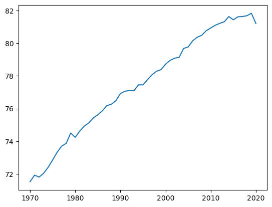
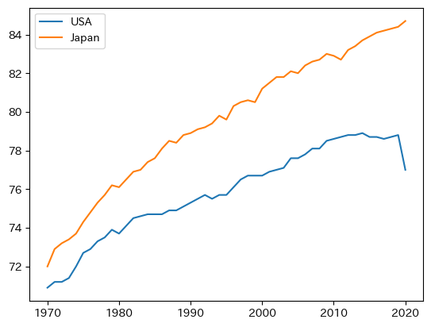
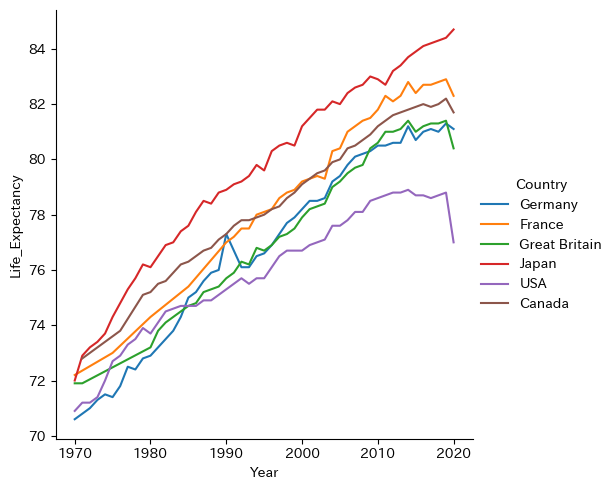
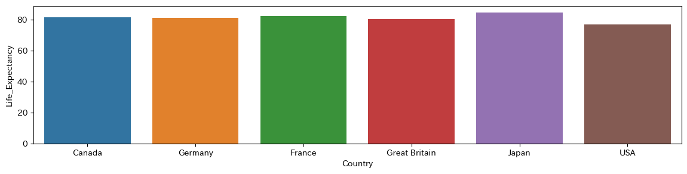
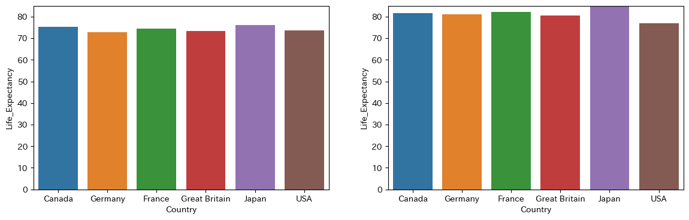
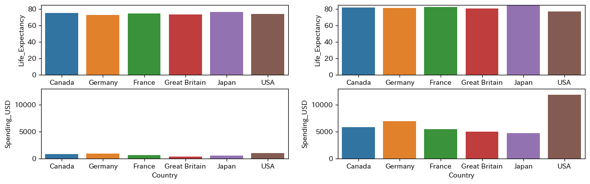
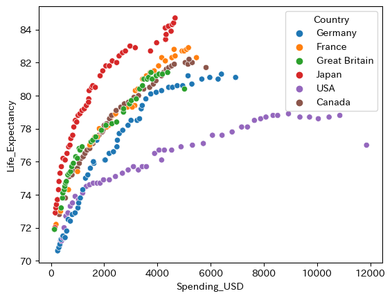

# 可視化の意味
- 大量のデータをグラフで表現すると、その特徴、傾向が直感的に理解しやすくなる
- データの種類によって適したグラフを選択する必要がある
- データを予め表形式(dataframe)にしておくと、可視化しやすい

# 平均寿命と医療支出のデータセット
以下のような表形式(dataframe)データから、いろいろなグラフで可視化を試みる

  1. 平均寿命の推移
  2. 上記の国別推移
  3. 2020年における国別平均寿命の比較
  2. 2020年における国別医療支出の比較（3.と比較できるように両方を描画する）
  3. 1970年における国別平均寿命、国別医療支出の比較
  4. 医療支出と平均寿命の関連性を可視化する


```python
import seaborn as sns

lifespan = sns.load_dataset("healthexp")
lifespan

```


<div>
<style scoped>
    .dataframe tbody tr th:only-of-type {
        vertical-align: middle;
    }

    .dataframe tbody tr th {
        vertical-align: top;
    }

    .dataframe thead th {
        text-align: right;
    }
</style>
<table border="1" class="dataframe">
  <thead>
    <tr style="text-align: right;">
      <th></th>
      <th>Year</th>
      <th>Country</th>
      <th>Spending_USD</th>
      <th>Life_Expectancy</th>
    </tr>
  </thead>
  <tbody>
    <tr>
      <th>0</th>
      <td>1970</td>
      <td>Germany</td>
      <td>252.311</td>
      <td>70.6</td>
    </tr>
    <tr>
      <th>1</th>
      <td>1970</td>
      <td>France</td>
      <td>192.143</td>
      <td>72.2</td>
    </tr>
    <tr>
      <th>2</th>
      <td>1970</td>
      <td>Great Britain</td>
      <td>123.993</td>
      <td>71.9</td>
    </tr>
    <tr>
      <th>3</th>
      <td>1970</td>
      <td>Japan</td>
      <td>150.437</td>
      <td>72.0</td>
    </tr>
    <tr>
      <th>4</th>
      <td>1970</td>
      <td>USA</td>
      <td>326.961</td>
      <td>70.9</td>
    </tr>
    <tr>
      <th>...</th>
      <td>...</td>
      <td>...</td>
      <td>...</td>
      <td>...</td>
    </tr>
    <tr>
      <th>269</th>
      <td>2020</td>
      <td>Germany</td>
      <td>6938.983</td>
      <td>81.1</td>
    </tr>
    <tr>
      <th>270</th>
      <td>2020</td>
      <td>France</td>
      <td>5468.418</td>
      <td>82.3</td>
    </tr>
    <tr>
      <th>271</th>
      <td>2020</td>
      <td>Great Britain</td>
      <td>5018.700</td>
      <td>80.4</td>
    </tr>
    <tr>
      <th>272</th>
      <td>2020</td>
      <td>Japan</td>
      <td>4665.641</td>
      <td>84.7</td>
    </tr>
    <tr>
      <th>273</th>
      <td>2020</td>
      <td>USA</td>
      <td>11859.179</td>
      <td>77.0</td>
    </tr>
  </tbody>
</table>
<p>274 rows × 4 columns</p>
</div>


# 1. グラフライブラリ　matplotlib　で折れ線グラフを描く


### 1) 折れ線グラフを描く

**構文**

---
```python
import matplotlib.pyplot as plt 　->　matplotlibを使う宣言
plt.plot(x, y) -> 折れ線グラフを描く関数 x: 時間軸の配列 y:時間軸での値の配列　xとyの要素数は一致する必要がある
plt.show() -> グラフを可視化する
```
---
外国人訪問者数の推移


```python
import matplotlib.pyplot as plt
ls_country = lifespan.groupby('Year',as_index=False).mean(numeric_only=True)
x = ls_country['Year']
y = ls_country['Life_Expectancy']
print(x)
print(y)
plt.plot(x, y)
plt.show()
```

    0     1970
    1     1971
    2     1972
    3     1973
    4     1974
    5     1975
    6     1976
    7     1977
    8     1978
    9     1979
    10    1980
    11    1981
    12    1982
    13    1983
    14    1984
    15    1985
    16    1986
    17    1987
    18    1988
    19    1989
    20    1990
    21    1991
    22    1992
    23    1993
    24    1994
    25    1995
    26    1996
    27    1997
    28    1998
    29    1999
    30    2000
    31    2001
    32    2002
    33    2003
    34    2004
    35    2005
    36    2006
    37    2007
    38    2008
    39    2009
    40    2010
    41    2011
    42    2012
    43    2013
    44    2014
    45    2015
    46    2016
    47    2017
    48    2018
    49    2019
    50    2020
    Name: Year, dtype: int64
    0     71.520000
    1     71.920000
    2     71.800000
    3     72.033333
    4     72.400000
    5     72.850000
    6     73.325000
    7     73.700000
    8     73.866667
    9     74.500000
    10    74.233333
    11    74.620000
    12    74.920000
    13    75.120000
    14    75.420000
    15    75.616667
    16    75.860000
    17    76.180000
    18    76.260000
    19    76.480000
    20    76.916667
    21    77.060000
    22    77.100000
    23    77.083333
    24    77.450000
    25    77.450000
    26    77.766667
    27    78.066667
    28    78.283333
    29    78.383333
    30    78.716667
    31    78.950000
    32    79.083333
    33    79.133333
    34    79.683333
    35    79.766667
    36    80.150000
    37    80.366667
    38    80.483333
    39    80.766667
    40    80.933333
    41    81.100000
    42    81.216667
    43    81.316667
    44    81.633333
    45    81.433333
    46    81.616667
    47    81.633333
    48    81.683333
    49    81.833333
    50    81.200000
    Name: Life_Expectancy, dtype: float64
    


    

    


国籍別の推移

### 2) グラフを重ねて表示

**構文**

---
```python
import matplotlib.pyplot as plt 　->　matplotlibを使う宣言

グラフを関数を必要なだけ書く

plt.show() -> グラフを可視化する（上記のグラフを重ね合わせて表示する）
```
---


```python
import japanize_matplotlib
us = lifespan[lifespan['Country'] == 'USA' ]
jpn = lifespan[lifespan['Country'] == 'Japan' ]
x = us['Year']
y = us['Life_Expectancy']
plt.plot(x, y,label='USA')
x = jpn['Year']
y = jpn['Life_Expectancy']
plt.plot(x, y,label='Japan')
plt.legend()
plt.show()
```


    

    


#### 全国籍を上記の方法で描くのは大変！
# 2.グラフライブラリ seaborn による折れ線グラフ
1. matplotlibと比較してグラフを少ないコードで描くことができる
3. DataFrameからのグラフ描画に特化（matplotlibは様々なデータ型に対応）：凡例、軸名などを自動表示する
4. 定型的なグラフだけに特化。matplotlibのほうが柔軟。
5. ケースバイケースでmatplotlibとseabornを使い分ける

**構文** 

---
```python
import seaborn as sns
sns.relplot(x=DataFrameの時間軸のカラム名, y=DataFrameで時間毎に表示したいカラム名,  data=,DataFrame名, kind="line",  hue=重ねたいグラフの凡例)
```
---


```python
import seaborn as sns
import japanize_matplotlib

sns.relplot(x="Year", y="Life_Expectancy",  data=lifespan, kind="line",  hue="Country")
plt.show()
```


    

    


# 3. seabornで棒グラフを描く 
### 1) 2020年における国別平均寿命の比較

**構文**

---
```python
sns.barplot( x = DataFrameのカラム名, y=DataFrameの列名,  data=,DataFrame名)
```

---


```python
lifespan_2020 = lifespan[lifespan['Year']==2020]
plt.figure(figsize=[14,3])
sns.barplot( x = "Country", y = "Life_Expectancy",data=lifespan_2020)
plt.show()
```


    

    


# 4. 複数のグラフ描画区画を用意する
### 1) 1980と2020の国別平均寿命を左右対称する
   
**構文**

---
```python
fig,ax = plt.subplots(グラフ区画の行数,グラフ区画の列数,figsize=(,))

## 上記で定義したグラフ区画数分グラフ描画するコーディングを書く
## この際に、各グラフをどの区画に対応付けるかは、ax=で指定する
　　　例：sns.barplot( ーーーー,ax=ax[0])
```
---


```python
fig,ax = plt.subplots(1,2,figsize=(14,4))
lifespan_2020 = lifespan[lifespan['Year']==2020]
lifespan_1970 = lifespan[lifespan['Year']==1980]
sns.barplot( x = "Country", y = "Life_Expectancy",data=lifespan_1970,ax=ax[0])
sns.barplot( x = "Country", y = "Life_Expectancy",data=lifespan_2020,ax=ax[1])
ax[0].set_ylim(0, 85)
ax[1].set_ylim(0, 85) #縦軸のスケールをそろえる
plt.show()
```


    

    


### 2) 上段は上記と同じグラフを、下段は1980,2020の国別の医療支出費を表示する（つまり4区画表示する）


```python
fig,ax = plt.subplots(2,2,figsize=(14,4))
lifespan_2020 = lifespan[lifespan['Year']==2020]
lifespan_1970 = lifespan[lifespan['Year']==1980]
sns.barplot( x = "Country", y = "Life_Expectancy",data=lifespan_1970,ax=ax[0,0])
sns.barplot( x = "Country", y = "Life_Expectancy",data=lifespan_2020,ax=ax[0,1])
sns.barplot( x = "Country", y = "Spending_USD",data=lifespan_1970,ax=ax[1,0])
sns.barplot( x = "Country", y = "Spending_USD",data=lifespan_2020,ax=ax[1,1])
ax[0,0].set_ylim(0, 85)
ax[0,1].set_ylim(0, 85) #縦軸のスケールをそろえる
ax[1,0].set_ylim(0, 13000)
ax[1,1].set_ylim(0, 13000) #縦軸のスケールをそろえる
plt.show()
```


    

    


- 医療支出は非常に負担が大きくなっている割に、平均寿命はせいぜい5歳程度しか伸びていない。特に米国はほとんど寿命が延びていない

# 5. 散布図を描く
医療支出と平均寿命の関連性


```python
ax = sns.scatterplot(data=lifespan, x = "Spending_USD", y = "Life_Expectancy", hue = "Country")
```


    

    


**医療支出のわりに寿命があまり伸びていない国は米国、逆に寿命が非常に伸びているのが日本**


```python

```
